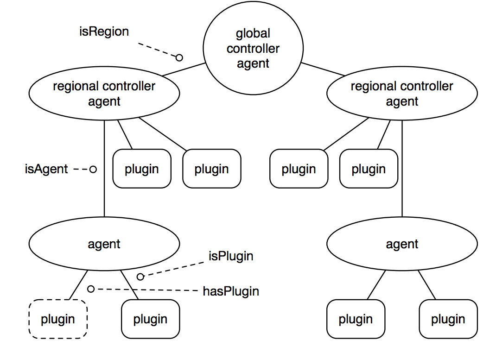

======

Cresco is a free and open source edge computing framework.

## Quick Start

#### Cresco Agent Network
Cresco agents, through their Cresco-Agent-Controller-Plugin, arrange themselves into a hierarchy of a global, with a single controller, regions, each with a single regional controller, and a set of agents inside a region. The following diagram illustrates this hierarchy:

* This topology allows for distributed control, meaning that an agent controls its plugins, a region controls its agents and the global controls the regions over which it is in charge.

#### Getting Started : Native
* Getting started with Cresco is fairly simple, with steps as follows:
 1. Download/update/confirm a [Java Runtime Environment](http://www.oracle.com/technetwork/java/javase/overview/index.html) (JRE, Java Runtime) 1.8 or greater.
 2. Download the [latest agent build](https://github.com/CrescoEdge/agent/releases)
 3. Modify the configuration files for the agent and plugins (please refer to the wiki for configuration information)
 4. Run the agent with `java -Dis_global=true -jar agent-<version>.jar`
 
### Using the client library:

Do client lib things here

## Cresco Components

#### Cresco Framework
 * [Agent](https://github.com/CrescoEdge/agent): The main runtime which manages the loading of the Core, Library, Controller, and underlying OSGi support components. 
 * [Core](https://github.com/CrescoEdge/core):  Core component loaded by the Cresco Agent to control logging and updates.
 * [Library](https://github.com/CrescoEdge/library):  Library functions used by all Cresco plugins, including the controller.
 * [Controller](https://github.com/CrescoEdge/controller):  The Controller, as the name suggest, manages all Cresco functions.  Optional Repository, SysInfo, and Dashboard components are included with the Controller plugin.
 * [Repository](https://github.com/CrescoEdge/repo): Repository plugin used to store, report, and deploy Cresco Plugins.
 * [SysInfo](https://github.com/CrescoEdge/sysinfo):  Plugin used to gather information about the operating environment.
 * [Dashboard](https://github.com/CrescoEdge/dashboard):  The Dashboard is a web-based user interface for a Cresco environment. 

## Cresco Development
 
#### Cresco Framework Example Plugins
 * [Cresco-Skeleton-Plugin](https://github.com/ResearchWorx/Cresco-Skeleton-Plugin): (Old Don't use) This project exists as a basic starting point for building a custom Cresco plugin.

 
#### Further Reading
* For a more in-depth explanation of Cresco, you can read one of the author's [dissertation](http://uknowledge.uky.edu/cgi/viewcontent.cgi?article=1061&context=cs_etds).

#### Why the name Cresco?
 
* Proto-Indo-European *ker ("to grow"). 
* Old Armenian սերիմ (serim, "be born") and սերեմ (serem, "bring forth")
* Latin creare ("become visible, multiply, augment")
