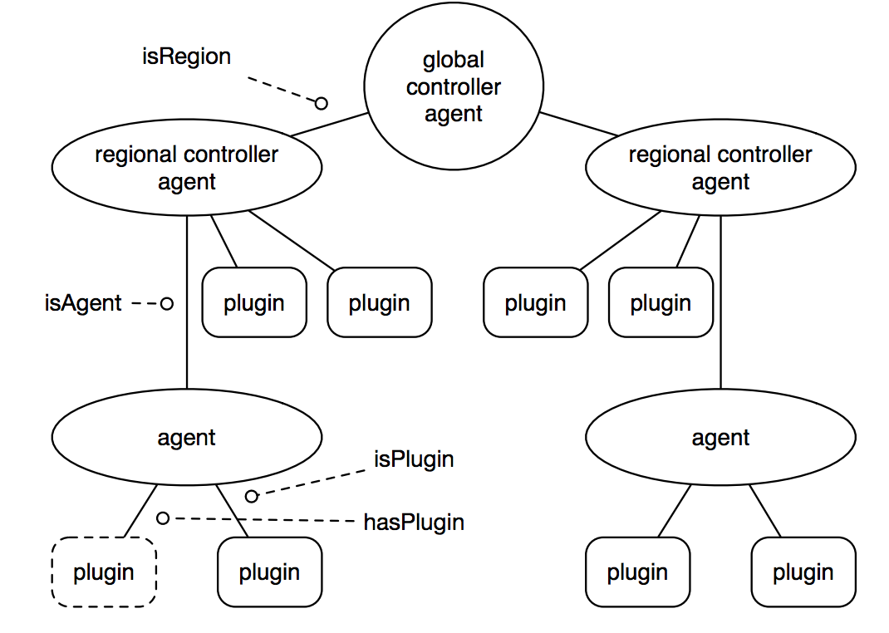

# Architecture Overview

Cresco is a **hierarchical mesh of agents**. This page is the mental model; the following pages drill into
each subsystem.

## Nodes and the hierarchy

Every Cresco node is a JVM running an OSGi (Apache Felix) host that loads the [controller](../plugins/controller.md)
and a set of [plugins](../plugins/overview.md). A node runs in one of five **controller modes**:

| Mode | Description |
|------|-------------|
| `STANDALONE` | A single node with no parent. |
| `AGENT` | A leaf; connects as a client to a regional controller's broker. |
| `REGION` | A regional controller; runs an embedded broker and federates up to a global. |
| `REGION_GLOBAL` | Both a region and the global (a self-contained fabric). |
| `GLOBAL` | The top of the hierarchy; federates regions together. |

```
                         ┌────────────────────┐
                         │  GLOBAL controller │        (federates regions; wsapi :8282 for clients)
                         └─────────┬──────────┘
                 broker bridge ────┼──── broker bridge
              ┌───────────────────┐│┌───────────────────┐
              │ REGION controller │││ REGION controller │   (each runs its own ActiveMQ broker)
              └───────┬───────────┘│└──────────┬────────┘
            JMS client│   JMS client│           │JMS client
          ┌───────┐ ┌─┴─────┐   ┌───┴───┐    ┌──┴────┐
          │ AGENT │ │ AGENT │   │ AGENT │    │ AGENT │        (leaf nodes running plugins)
          └───────┘ └───────┘   └───────┘    └───────┘
```

**Brokers vs. clients:** region and global controllers run an **embedded ActiveMQ broker**; agents are
JMS **clients** that attach to their region's broker. Regions federate to the global (and globals to each
other) via broker-to-broker **network bridges**.

{ width="640" }

## The two planes

| Plane | Carrier | Used for |
|-------|---------|----------|
| **Control plane** | [MsgEvent](../api/msgevent.md) over ActiveMQ **queues** | addressed commands, config, RPC, watchdog/liveness, telemetry |
| **[Data plane](dataplane.md)** | ActiveMQ **topics** (pub/sub) | high-throughput streaming of application data |

Messages are addressed by `region_agent[_plugin]` and routed deterministically by the
[MsgRouter](messaging.md); the data plane is subscription-driven pub/sub.

## Subsystems

The [controller](../plugins/controller.md) is the fabric brain. Its subsystems, each documented here:

| Subsystem | Page | Role |
|-----------|------|------|
| Messaging & routing | [Messaging & Routing](messaging.md) | MsgEvent, MsgRouter, ActiveMQ brokers, federation bridges, QoS |
| Data plane | [Data Plane](dataplane.md) | streaming topics, sharding, CEP |
| Discovery | [Discovery](discovery.md) | UDP/TCP discovery, join secrets, certification |
| Security & identity | [Security & Identity](security.md) | X.509 identity, mutual TLS, regional-CA trust, signing |
| Multi-tenancy | [Multi-Tenancy](tenancy.md) | destination namespacing, role-based authorization |
| Health & state | [Health & State](health.md) | Felix health checks, mesh health rollup, state machine |
| Metrics | [Metrics & Measurements](metrics.md) | Micrometer model, mesh-wide `getmetricinventory` |

State and inventory (nodes, plugins, edges, health) are persisted per-controller in an embedded **Derby**
database.

## Lifecycle at a glance

1. A node boots the Felix host and the controller ([agent](../plugins/agent.md) module).
2. It [discovers](discovery.md) a parent (region/global) by broadcasting/connecting with the tier
   **join secret**, and exchanges/establishes [trust](security.md).
3. It opens its [messaging](messaging.md) channels (inbox queue + producers) and, if a controller, starts
   its broker and federation bridges.
4. [Watchdog/liveness](health.md) pings keep parent links healthy; [metrics](metrics.md) stream to the
   controller; plugins register their [actions](../api/plugin-actions.md).
5. Clients attach to the global's [wsapi](../plugins/wsapi.md) and drive the fabric.
